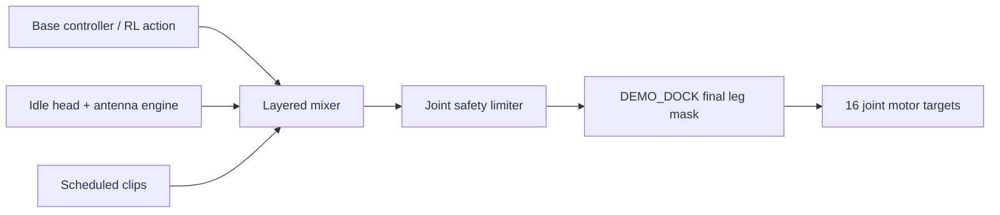

# Open Duck Mini animation system

Animations supplement, rather than replace, the balance controller. Clips are
`.duckanim.json` files at 50 Hz with radians as their unit:

```jsonc
{
  "format_version": 1, // schema version
  "name": "curious_tilt",
  "fps": 50, "loop": false, "duration": 0.6,
  "blend_in": 0.1, "blend_out": 0.15, "priority": 10,
  "layer": "override", // absolute head target, not an offset
  "joints": ["head_roll", "head_yaw"],
  "joint_weights": {"head_roll": 1.0, "head_yaw": 1.0},
  "frames": [[0.0, 0.0]], // one row per 1/50 second
  "metadata": {"tags": ["curious"]}
}
```



Composition is base controller, idle engine, scheduled animation clips, safety
limiter, then (in `DEMO_DOCK`) the final dock leg mask. Head and antenna clips
use `override`, because they set a clear communicative pose. Full-body clips
must be small `additive` offsets so balance remains controller-owned. As walking
speed rises, leg animation authority must shrink to zero. The RL observation is
fed the policy's raw action, not the blended motor target, preventing animation
from becoming an unmodelled feedback signal.

Modes are `IDLE`, `STAND`, `WALK`, `HYBRID_STAND`, `HYBRID_WALK`, `DEMO_DOCK`,
and `EMERGENCY_STOP`. `DEMO_DOCK` accepts only head/antenna clips: all clips
touching a leg are refused, and after every possible operation the output's ten
leg bytes are overwritten with the docked pose. This is a hard safety guarantee,
not a convention.

To add an animation: author and export the clip, validate it, add tags and an
appropriate layer, place it in `animation/clips/`, then register its name,
weight, and cooldown with `BehaviorScheduler`. Test it in simulation before
hardware, and confirm `DockMode` rejects it if it contains a leg joint.
