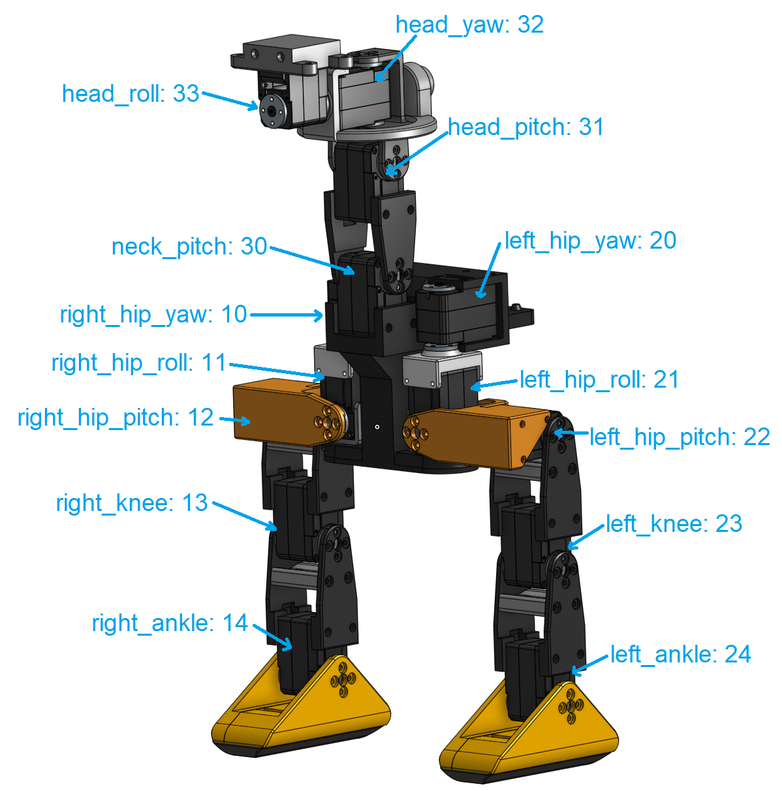

# Configure the motors

> This sould be done independently on each motor *before* builiding the duck.
>
> During the process, the motor will move to its zero position. You can then install the horn while trying to align it the best you can like in the photo below. (Don't worry if it's not perfect, we will compensate for that later)


Clone and install (`pip install -e .`) the runtime repo on the `v2` branch : `https://github.com/apirrone/Open_Duck_Mini_Runtime`

You can either install it on your own computer or on the raspberry pi for the configuration, as you want. You'll just want a way to power the servos, for example, the battery pack.


Then for each motor, run the following command : 

```bash
python configure_motor.py --id <id>
```

The motors ids are : 

```python
{
    "left_hip_yaw": 20,
    "left_hip_roll": 21,
    "left_hip_pitch": 22,
    "left_knee": 23,
    "left_ankle": 24,
    "neck_pitch": 30,
    "head_pitch": 31,
    "head_yaw": 32,
    "head_roll": 33,
    "right_hip_yaw": 10,
    "right_hip_roll": 11,
    "right_hip_pitch": 12,
    "right_knee": 13,
    "right_ankle": 14,
}
```

You can also see which motor corresponds to which id in the photo below :
